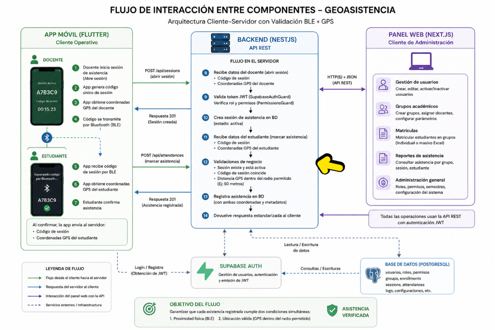

<p align="center">
  
</p>

<h1 align="center">GeoAsistencia (BACKEND)</h1>

<p align="center">
  
  
  
  
  
  
  
  
</p>

---

## Descripción

GeoAsistencia es una plataforma desarrollada para digitalizar y automatizar el proceso de control de asistencia
en ambientes de formación. La solución permite que un docente inicie una sesión de clase desde su ubicación actual 
y que los estudiantes registren su asistencia únicamente cuando se encuentran dentro del radio geográfico permitido.
Además del control de asistencia, la plataforma incorpora herramientas de gestión académica, administración de 
usuarios, control de acceso basado en permisos y módulos de analítica para la toma de decisiones.


<p align="center">
  
</p>

---

## 🔐 Características principales

### Seguridad y autenticación

- Autenticación mediante **Supabase Auth**
- Validación de **JWT** usando **JWKS**
- Guard global de autenticación
- Endpoints públicos mediante decoradores personalizados
- Sistema de **Roles y Permisos (RBAC)**

### Control de asistencia por geolocalización

- Registro de asistencia mediante coordenadas GPS
- Validación de radio configurable
- Apertura y cierre de sesiones de clase
- Historial de asistencias por estudiante
- Prevención básica de registros fuera del aula

### Gestión académica

- Administración de docentes
- Administración de estudiantes
- Gestión de asignaturas
- Gestión de semestres académicos
- Creación de grupos de clase
- Gestión de matrículas
- Reasignación de estudiantes entre grupos

### Dashboard y analítica

#### Docentes

- Total de sesiones realizadas
- Tasa global de asistencia
- Total de estudiantes matriculados
- Identificación de grupos críticos
- Distribución de estados de asistencia
- Asistencia por grupo

#### Administradores

- Indicadores institucionales
- Métricas filtradas por semestre
- Métricas filtradas por docente
- Métricas filtradas por asignatura
- Reportes consolidados de asistencia

### Importación masiva

- Usuarios desde Excel
- Matrículas desde Excel
- Validación fila por fila
- Reporte de errores durante la importación

### Documentación

- Swagger / OpenAPI
- DTOs documentados
- Validaciones centralizadas
- Respuestas estandarizadas


## 🏗️ Arquitectura

El proyecto sigue las convenciones y buenas prácticas de NestJS con una separación clara de responsabilidades:

```
src/
├── academic/               # Semestres y asignaturas
├── access-control-module/  # Roles, permisos y menú de navegación
├── auth/                   # Integración con Supabase Auth
├── class-group/            # Grupos, sesiones, días de clase, asistencias y matrículas
├── common/                 # Infraestructura compartida
│   ├── decorators/         # @GetUser, @PublicAccess, @RequiredPermissions
│   ├── dtos/               # PaginationDto, PaginatedResponseDto<T>
│   ├── enums/              # Enums globales (roles, estados, días de semana)
│   ├── filters/            # HttpExceptionFilter global
│   ├── guard/              # SupabaseAuthGuard, PermissionsGuard
│   ├── interceptors/       # ResponseInterceptor global
│   ├── interface/          # ICurrentUser, IStandardResponse
│   └── utils/              # toDto(), toPaginatedDto()
├── seed/                   # Seed de datos para desarrollo
├── supabase/               # Cliente y Admin de Supabase
├── dashboard/               # Metricas e indicadores
└── users/                  # Usuarios, docentes y estudiantes
```

### Principios aplicados

- **Servicios devuelven entidades** — los controladores mapean a DTOs de respuesta con `toDto()` y `toPaginatedDto()`.
- **Guard global de autenticación** — `SupabaseAuthGuard` registrado con `APP_GUARD`. Los endpoints públicos se marcan con `@PublicAccess()`.
- **Errores internos vs errores de cliente** — los mensajes de sistemas externos (Supabase, TypeORM) se loguean con el `Logger` de NestJS y nunca se exponen al cliente.
- **`synchronize` desactivado en producción** — se usan migraciones de TypeORM en entornos productivos.

---

## 🚀 Cómo correr el proyecto

### Requisitos

- Node.js >= 20
- pnpm (recomendado) o npm
- PostgreSQL
- Cuenta de Supabase

### 1. Clonar el repositorio

```bash
git clone https://github.com/tu-usuario/GeoAsistencia-SENA.git
cd GeoAsistencia-SENA
```

### 2. Instalar dependencias

```bash
pnpm install
```

### 3. Configurar variables de entorno

Crea un archivo `.env` en la raíz del proyecto:

```env
DATABASE_URL=...
SUPABASE_SERVICE_ROLE_KEY=...
SUPABASE_URL=...
SUPABASE_JWKS_URL=...
SUPABASE_ISSUER=...
URL_LOCAL=...
ATTENDANCE_RADIUS_METERS=..
```

### 4. Correr en desarrollo

```bash
pnpm start:dev
```

### 5. Seed de datos (solo desarrollo)

```bash
GET http://localhost:3001/api/seed
```

> ⚠️ El endpoint de seed está protegido y **no está disponible en producción**.


## 🐳 Docker

```bash
# Construir imagen
docker build -t geoasistencia-sena .

# Correr contenedor
docker run -p 3001:3001 --env-file .env geoasistencia-sena
```


## 📖 Documentación de la API

Con el proyecto corriendo, accede al Swagger en:

```
http://localhost:3001/api/doc
```


## 📋 Endpoints principales

###  Usuarios

| Método | Endpoint | Descripción |
|----------|----------|-------------|
| `POST` | `/api/user` | Registrar usuario |
| `GET` | `/api/user/me` | Obtener perfil del usuario autenticado |
| `GET` | `/api/user` | Listar usuarios paginados |
| `GET` | `/api/user/:id` | Obtener detalle de usuario |
| `PATCH` | `/api/user/:id` | Actualizar información básica |
| `PATCH` | `/api/user/:id/roles` | Actualizar roles asignados |
| `PATCH` | `/api/user/:id/activate` | Activar usuario |
| `PATCH` | `/api/user/:id/deactivate` | Desactivar usuario |
| `PATCH` | `/api/user/reset-devices` | Reiniciar dispositivos registrados |
| `POST` | `/api/user/bulk/import` | Importación masiva desde Excel |
| `GET` | `/api/user/bulk/template` | Descargar plantilla Excel |
| `GET` | `/api/user/is-active` | Verificar si un usuario está activo |


###  Semestres

| Método | Endpoint | Descripción |
|----------|----------|-------------|
| `POST` | `/api/semester` | Registrar semestre académico |
| `GET` | `/api/semester` | Listar semestres paginados |
| `GET` | `/api/semester/all` | Listar semestres para selectores y filtros |
| `PATCH` | `/api/semester/:id` | Actualizar semestre |
| `PATCH` | `/api/semester/:id/state` | Cambiar estado del semestre |
| `DELETE` | `/api/semester/:id` | Eliminar semestre lógicamente |


### Asignaturas

| Método | Endpoint | Descripción |
|----------|----------|-------------|
| `POST` | `/api/subjects` | Registrar asignatura |
| `GET` | `/api/subjects` | Listar asignaturas paginadas |
| `GET` | `/api/subjects/all` | Listar asignaturas para selectores |
| `GET` | `/api/subjects/:term` | Buscar asignatura por ID, código o nombre |
| `PATCH` | `/api/subjects/:id` | Actualizar asignatura |
| `DELETE` | `/api/subjects/:id` | Eliminar asignatura lógicamente |
| `POST` | `/api/subjects/bulk/import` | Importación masiva desde Excel |
| `GET` | `/api/subjects/bulk/template` | Descargar plantilla Excel |


###  Grupos de clase

| Método | Endpoint | Descripción |
|----------|----------|-------------|
| `POST` | `/api/class-groups` | Crear grupo de clase |
| `GET` | `/api/class-groups` | Listar grupos |
| `GET` | `/api/class-groups/:id` | Obtener detalle de grupo |
| `PATCH` | `/api/class-groups/:id` | Actualizar grupo |
| `GET` | `/api/class-groups/:id/transfer-options` | Obtener grupos válidos para transferencia |

---

### Horarios y días de clase

| Método | Endpoint | Descripción |
|----------|----------|-------------|
| `POST` | `/api/class-days` | Registrar día de clase |
| `GET` | `/api/class-days/group/:id` | Obtener horarios del grupo |
| `PATCH` | `/api/class-days/:id/deactivate` | Desactivar horario |


### Sesiones de clase

| Método | Endpoint | Descripción |
|----------|----------|-------------|
| `POST` | `/api/class-sessions` | Iniciar llamado a lista |
| `PATCH` | `/api/class-sessions/:id/close` | Finalizar llamado a lista |
| `GET` | `/api/class-sessions/group/:id` | Listar sesiones de un grupo |
| `GET` | `/api/class-sessions/group/:id/active` | Obtener sesión activa |
| `GET` | `/api/class-sessions/:id/attendances` | Consultar asistencias de una sesión |


### Asistencias

| Método | Endpoint | Descripción |
|----------|----------|-------------|
| `PATCH` | `/api/attendances` | Registrar asistencia mediante GPS |
| `GET` | `/api/attendances/group/:groupId/my-history` | Historial de asistencias del estudiante |


### Matrículas

| Método | Endpoint | Descripción |
|----------|----------|-------------|
| `GET` | `/api/enrollment/:groupId` | Listar estudiantes matriculados |
| `POST` | `/api/enrollment/move` | Transferir estudiantes entre grupos |
| `PATCH` | `/api/enrollment/remove` | Retirar estudiantes del grupo |
| `POST` | `/api/enrollment/bulk/import/:groupId` | Matrícula masiva desde Excel |
| `GET` | `/api/enrollment/bulk/template` | Descargar plantilla Excel |


### Roles y permisos

| Método | Endpoint | Descripción |
|----------|----------|-------------|
| `GET` | `/api/role` | Listar roles del sistema |
| `PATCH` | `/api/role/:roleId/permissions/:permissionId/add` | Asignar permiso a un rol |
| `PATCH` | `/api/role/:roleId/permissions/:permissionId/remove` | Remover permiso de un rol |
| `GET` | `/api/permissions/matrix` | Obtener matriz completa de permisos |


###  Dashboard y reportes

| Método | Endpoint | Descripción |
|----------|----------|-------------|
| `GET` | `/api/dashboard/teacher/overview` | Métricas generales del docente |
| `GET` | `/api/dashboard/teacher/attendance` | Asistencia por grupo |
| `GET` | `/api/dashboard/teacher/distribution` | Distribución de estados de asistencia |
| `GET` | `/api/dashboard/teacher/groups-ranking` | Ranking de grupos |
| `GET` | `/api/dashboard/teacher/students-absences` | Estudiantes con más ausencias |
| `GET` | `/api/dashboard/admin/overview` | Indicadores institucionales |
| `GET` | `/api/dashboard/admin/attendance` | Asistencia global por grupo |
| `GET` | `/api/dashboard/admin/distribution` | Distribución global de asistencia |
| `GET` | `/api/dashboard/admin/subjects-ranking` | Ranking de asignaturas |
| `GET` | `/api/dashboard/admin/students-absences` | Estudiantes con más ausencias |


##  Licencia

Este proyecto es de uso privado y fue desarrollado como proyecto académico para el SENA.